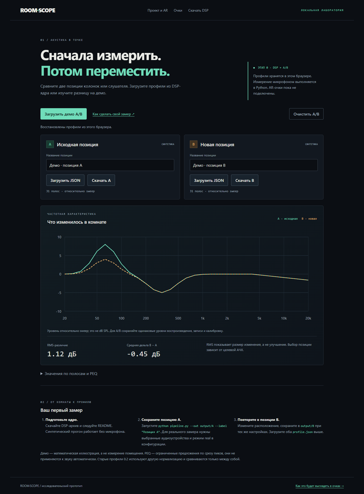

# RoomScope

Исследовательский AR-калибратор акустики комнаты: **измерить звук в точке → сохранить профиль → изменить расстановку → сравнить АЧХ → в будущем показать результат в очках**.

**Актуальный разбор:** [результаты повторной проверки, требования и выбор XREAL на 5 октября 2026](docs/requirements-and-xreal-review.md). Включает One + Eye, 1S, Ultra, AURA, критерии приёмки и план аппаратного прототипа.

Исходная задумка восстановлена из истории (`2d357e9`, `df547db`), дорожной карты и README внутри `downloads/roomscope-core.zip`. Очки XREAL Air 2 Ultra должны давать координаты и spatial anchors, внешний микрофон — измерение, Python — обработку, Unity/Android — пространственный интерфейс. Это личный исследовательский проект, а не готовый измерительный прибор.

## Что работает сейчас

- Python DSP: logarithmic sweep, синтетическая запись, путь записи через sounddevice, деконволюция IR, 1/3-октавная АЧХ, ограниченные PEQ-предложения, JSON и A/B-отчёт.
- **Лаборатория** (`workspace.html`): импорт/экспорт профилей, два графика, дельта по полосам, переименование, сохранение A/B в localStorage, демо без оборудования.
- **Проект** (`index.html`): сохранённая дорожная карта и четыре интерактивных слоя AR-макета; все показания явно обозначены как синтетические. `roadmap.html` сохраняет старый URL и якоря.
- Презентация аппаратной задумки, сборка статического сайта и актуального DSP-архива, тесты и CI.

**Ещё не реализовано:** Unity-проект/APK, настоящий 6DoF, anchors/mesh, live RTA с микрофона в браузере, калибровка UMIK-1, абсолютный SPL, синхронизация с очками, модель мод комнаты и вычисляемые стрелки размещения. Иллюстрации на дорожной карте не являются этими функциями. Реальное аудиооборудование в текущей проверке не использовалось.



## Быстрый запуск сайта

Node.js **22.12+** (проверено на 24.19), npm; установка зависимостей требует сети.

```sh
npm ci
npm run dev
# http://127.0.0.1:5173/workspace.html
```

```sh
npm run lint
npm test
npm run build
npm run preview -- --port 4173
# http://127.0.0.1:4173/workspace.html
npx playwright install chromium
npm run test:e2e
```

Для E2E production задайте `BASE_URL=http://127.0.0.1:4173` (PowerShell: `$env:BASE_URL='http://127.0.0.1:4173'`) перед `npm run test:e2e`. Без `BASE_URL` Playwright сам запускает dev-сервер. Тесты проходят в desktop и mobile Chromium, включая ошибки консоли и сетевых запросов.

Для публикации загрузите **содержимое `dist/`** на любой статический HTTP(S)-хост. Сборка использует относительные пути, API/секреты/серверная БД не нужны. Открытие исходников через `file://` не поддерживается для модулей лаборатории. `npm run dev` и `npm run build` автоматически собирают актуальный `public/downloads/roomscope-core.zip`. Исходный ZIP в `downloads/` оставлен только как исторический материал, публичная production-загрузка берётся из новой сборки.

## DSP: установка и синтетический замер

Python **3.11 или 3.12**. Зависимости закреплены; полный снимок проверенной среды — `roomscope-core/requirements-lock.txt`.

```sh
python -m venv .venv
# macOS/Linux
source .venv/bin/activate
# Windows PowerShell вместо предыдущей команды:
# .venv\Scripts\Activate.ps1
python -m pip install -r roomscope-core/requirements-lock.txt
python roomscope-core/pipeline.py --out roomscope-core/output/A --label "Позиция A"
python roomscope-core/pipeline.py --out roomscope-core/output/B --label "Позиция B"
python roomscope-core/compare_profiles.py roomscope-core/output/A/profile.json roomscope-core/output/B/profile.json --plot roomscope-core/output/compare.png
python -m pytest
python -m ruff check roomscope-core
```

В каждой папке сеанса сохраняются `sweep.wav`, `recording.wav`, `ir.wav`, `profile.json`. Загрузите профили в лабораторию. Синтетическая комната и seed одинаковые: повторные прогоны должны дать **RMS=0**. Браузерное демо намеренно содержит две разные модельные кривые для изучения A/B. Pipeline отказывается перезаписывать непустой каталог; для следующего замера используйте новое имя.

Если локальная Python-сборка не умеет создавать pip в venv, можно использовать pip основной установки: `python -m pip --python .venv install -r roomscope-core/requirements-lock.txt`, а команды запускать через `.venv/Scripts/python.exe`. На Linux для реального аудио может потребоваться системная библиотека PortAudio.

## Реальное измерение

1. `python roomscope-core/measurement.py --list-devices` показывает доступные входы и выходы.
2. Создайте свою копию `roomscope-core/config.json`: `mode: "real"`, явные `input_device` и `output_device`, один входной канал. Устройства должны поддерживать выбранную частоту дискретизации.
3. Начните с низкой громкости усилителя и амплитуды sweep `0.1`; отключите AGC, шумоподавление и другие улучшения записи. Запуск в real-режиме **проигрывает звук**.
4. `python roomscope-core/pipeline.py --config my-config.json --out roomscope-core/output/real-A --label "Диван A"`.
5. Проверьте запись, повторите для B с теми же уровнями и настройками. Клиппинг/тишина отклоняются. `tail_duration` по умолчанию 1 секунда; для длинного затухания увеличьте его.

Калибровочный файл микрофона пока не применяется. Значения — относительная передаточная характеристика, **не dB SPL**. Разные clock domains USB-микрофона и выхода могут давать дрейф. Аппаратный loopback, известный эталон и сравнение с независимым измерительным ПО ещё нужны. PEQ только предлагает срез локальных пиков до 12 дБ, не усиливает провалы и не применяется автоматически. Это эвристика, не оптимизированный фильтр-корректор.

## Архитектура

```text
index.html / presentation.html   → проект и аппаратная задумка
roadmap.html                    → совместимый переход на index + hash
workspace.html                  → интерфейс A/B
assets/profiles.js              → чистая модель, валидация, сравнение
assets/workspace.js             → DOM, импорт/экспорт, localStorage
assets/roadmap.js               → AR-слои, единый цикл анимации, пауза
roomscope-core/measurement.py    → аудиоввод/вывод и синтетическая комната
roomscope-core/dsp/              → sweep, IR, АЧХ, PEQ, численные контракты
roomscope-core/pipeline.py       → воспроизводимый сеанс в одном каталоге
scripts/package-core.mjs        → ZIP из проверяемого исходного кода
tests/ + roomscope-core/tests/   → модель, браузер, DSP и pipeline
```

Без React, бэкенда или переписывания на другой стек: Vite нужен только для модулей, dev-сервера и статической сборки. Подробности формата — [контракт профиля](docs/profile-format.md); проблемы, исправления и ограничения — [технический аудит](docs/audit.md).

## Следующие три шага

1. **Достоверность измерения:** UMIK-1 calibration, аппаратный loopback, контроль дрейфа и повторяемости, сопоставление с эталонным ПО.
2. **Минимальный native AR:** Unity/XREAL проект с одной world-locked АЧХ, проверка tracking/anchor и совместимости конкретного хоста. Официальная [таблица XREAL](https://docs.xreal.com/XREALDevices/XREAL%20Glasses) и [совместимость](https://docs.xreal.com/XREALDevices/Compatibility) должны определять выбор оборудования; второй USB-C на Beam Pro не считается подтверждённым USB-аудиовходом.
3. **Сеансы и координаты:** привязать проверенные профили к позиции слушателя/колонки, добавить транспорт Python → Unity и повторный A/B в одной точке. Модели мод и стрелки — после этих проверок.
